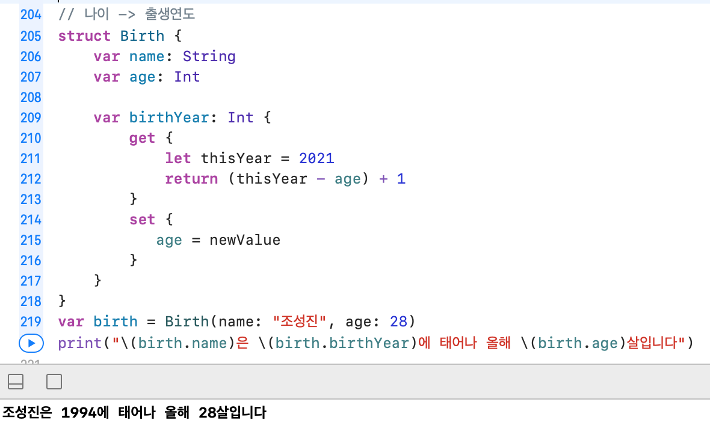

# 🟢 Day11 TIL - 211013 🟢

▶︎ [TypeCasting](#️-typecasting)

▶︎ [Stored Property](#️-stored-property)

▶︎ [Computed Property](#️-computed-property)

▶︎ [Property Observer](#️-property-observer)


***

<br>

## ✔️ TypeCasting

* 인스턴스의 타입을 확인 하거나, 해당 인스턴스를 슈퍼 클래스나 서브클래스로 취급하는 방법

* #### is

  > 표현식 is Type

  * 타입을 확인하는 연산자로 표현식이 Type과 동일한 타입이거나 **서브클래스**인 경우 true를 반환

```swift
class Mobile {
    let name: String
    
    init(name: String) {
        self.name = name
    }
}
class AppleMobile: Mobile {
    var company = "애플"
}
class GoogleMobile: Mobile {
}

let mobile = Mobile(name: "PHONE")
let apple = AppleMobile(name: "iPHONE")
let google = GoogleMobile(name: "Galaxy")

mobile is Mobile // true
mobile is AppleMobile // false
mobile is GoogleMobile // false

apple is Mobile // true
apple is AppleMobile // true
apple is GoogleMobile //false
```

* #### as

  > **표현식** **as** (**변환 할**)Type
  >
  > **표현식** **as**? (**변환 할**)Type
  >
  > **표현식** **as**! (**변환 할**)Type

  * 표현식(의 타입)이 변환할 Type과 호환된다면, 변환할 Type으로 캐스팅된 인스턴스를 리턴한다
  * 상속 관계인 `Upcasting(서브 클래스의 인스턴스를 슈퍼 클래스의 타입으로 참조)`과 `Downcasting(슈퍼 클래스의 인스턴스를 서브 클래스의 타입으로 참조하는 것)`에서 사용한다
  * Any와 AnyObject 타입을 사용할 경우, 상속 관계가 아니어도 예외적으로 사용할 수 있다

```swift
let array: [Any] = [1, true, "안녕"]
let arrayInt = array as? [Int]  // nil
```

```swift
let iPhone1 = AppleMobile(name: "iPad") as Mobile // as를 사용한 업캐스팅
let iPhone2: Mobile = AppleMobile(name: "iPad") // 타입 어노테이션을 사용한 업캐스팅
iPhone.name	// iPad
iPhone.company // error

iPhone as? AppleMobile	// 다운캐스팅
(iPhone as? AppleMobile)?.company	// 애플

if let value = iPhone as? AppleMobile { // if let 바인딩 구문과 as를 이용한 다운캐스팅
    print("옵셔널바인딩, 타입캐스팅 성공!", value.company) //옵셔널바인딩, 타입캐스팅 성공! 애플
}
```

[출처](https://babbab2.tistory.com/127)

<br>

<br>

## ✔️ Stored Property

* ### Variable / Constant Stored Property

* #### Struct

  * Value Type -> **인스턴스가 let으로 선언**되면 **모든 프로퍼티가 let으로 선언된 것 같이**된다

  ```swift
  struct DrinkStruct {
      let name: String	// 상수 저장 프로퍼티
      var count: Int	// 변수 저장 프로퍼티
      var size: DrinkSize
  }
  
  let drinkStruct = DrinkStruct(name: "아메리카노", count: 3, size: .tall)
  drinkStruct.count = 2 // error
  drinkStruct.size = .venti // error
  
  var drinkStruct = DrinkStruct(name: "아메리카노", count: 3, size: .tall)
  drinkStruct.count = 2 // 정상 작동
  drinkStruct.size = .venti // 정상 작동
  ```

* #### Class

  * Reference Type -> 원본에 바로 접근

  ```swift
  class DrinkClass {
      let name: String
      var count: Int
      var size: DrinkSize
      
      init(name: String, count: Int, size: DrinkSize) {
          self.name = name
          self.count = count
          self.size = size
      }
  }
  
  let drinkClass = DrinkClass(name: "블루베리스무디", count: 2, size: .venti)
  drinkClass.count = 5
  drinkClass.size = .tall
  ```

  

* ### Lazy Stored Property

  * 실제로 값이 사용될 때까지 생성을 지연시키는 프로퍼티

  * 사용조건

    > 1. 반드시 var와 함께 사용한다 : 초기에는 값이 존재하지 않고 이후에 값이 생기는 것이기 때문
    > 2. struct과 class에서만 사용
    > 3. 연산 프로퍼티에서는 사용 불가능 : lazy는 처음 사용될 때 메모리에 값을 올리고 그 이후 부터는 메모리에 올라온 값 사용하는데, 연산 프로퍼티는 사용될 때마다 값을 연산해 사용하기 때문

    ```swift
    struct Poster {
        var image: UIImage = UIImage(systemName: "star") ?? UIImage()
        
        init() {
            print("Poster Initialized")
        }
    }
    
    struct MediaInfo {
        var mediaTitle: String
        var mediaRuntime: Int
        lazy var mediaPoster: Poster = Poster() // 지연 저장 프로퍼티
    }
    
    var media = MediaInfo(mediaTitle: "오징어게임", mediaRuntime: 333)
    print("1") // mediaPoster 아직 생성되지 않음
    media.mediaPoster	// Poster Initialized
    print("2")
    ```

<br>

<br>

## ✔️ Computed Property

* ### Getter & Setter

  * set : 매개변수(newValue)를 같은 struct/class 내의 저장 프로퍼티로 대입
  * get : set에서 대입한 저장 프로퍼티를 이용해 연산하거나 최종적으로 얻어져야(반환)하는 것
  
  

```swift
class BMI {
    typealias BMIValue = Double
 
  	var userName: String
    var userWeight: BMIValue
    var userHeight: BMIValue
      
    var BMIResult: String {
        get { 
            let bmiValue = (userWeight * userWeight) / userHeight
            let bmiStatus = bmiValue < 18.5 ? "저체중" : "정상 이상"
            return "\(userName)님의 BMI지수는 \(bmiValue)는 \(bmiStatus)입니다"
        }
        set(nickname) {
            userName = nickname
        }
    }
    
    init(userName: String, userWeight: Double, userHeight: Double) {
        self.userName = userName
        self.userWeight = userWeight
        self.userHeight = userHeight
    }
}

let bmi = BMI(userName: "JACK", userWeight: 50, userHeight: 160)
print(bmi.BMIResult)	// JACK님의 BMI지수는 15.625는 저체중입니다
bmi.BMIResult = "MINSU"
print(bmi.BMIResult)	// HELLO님의 BMI지수는 15.625는 저체중입니다
```

<br>

<br>

## ✔️ Property Observer

* ### willSet & didSet

  * willSet : newValue
  * didSet : oldValue

```swift
class BMI {
    typealias BMIValue = Double
    
    var userName: String {
        willSet {
            print("닉네임 변경 예정: \(userName) -> \(newValue)")
        }
        didSet {
            changeNameCount += 1
            print("닉네임 변경 결과: \(oldValue) -> \(userName)")
        }
    }
    
    var changeNameCount = 0
    
    var userWeight: BMIValue
    var userHeight: BMIValue
    
    var BMIResult: String {
        get { 
            let bmiValue = (userWeight * userWeight) / userHeight
            let bmiStatus = bmiValue < 18.5 ? "저체중" : "정상 이상"
            return "\(userName)님의 BMI지수는 \(bmiValue)는 \(bmiStatus)입니다"
        }
        set(nickname) {
            userName = nickname
        }
    }
    
    init(userName: String, userWeight: Double, userHeight: Double) {
        self.userName = userName
        self.userWeight = userWeight
        self.userHeight = userHeight
    }
}

bmi.BMIResult = "MINSU"	// 닉네임 변경 예정: JACK -> MINSU 닉네임 변경 결과: JACK -> MINSU
bmi.BMIResult = "JACKIE" // 닉네임 변경 예정: MINSU -> JACKIE 닉네임 변경 결과: MINSU -> JACKIE
bmi.BMIResult = "HELLO" // 닉네임 변경 예정: JACKIE -> HELLO 닉네임 변경 결과: JACKIE -> HELLO
print(bmi.BMIResult)	// HELLO님의 BMI지수는 15.625는 저체중입니다
print(bmi.changeNameCount)	// 3
```

* #### tableView에서의 활용

  * list가 변경될 때 마다 `tableView.reloadData()` 를 실행

  ```swift
  class MemoTableViewController: UITableViewController {
  	
      var list: [String] = ["장 보기", "메모메모", "영화 보러 가기", "WWDC 시청하기"] {
          didSet {
              tableView.reloadData()	
          }
      }
  ```

  

<br><br>
