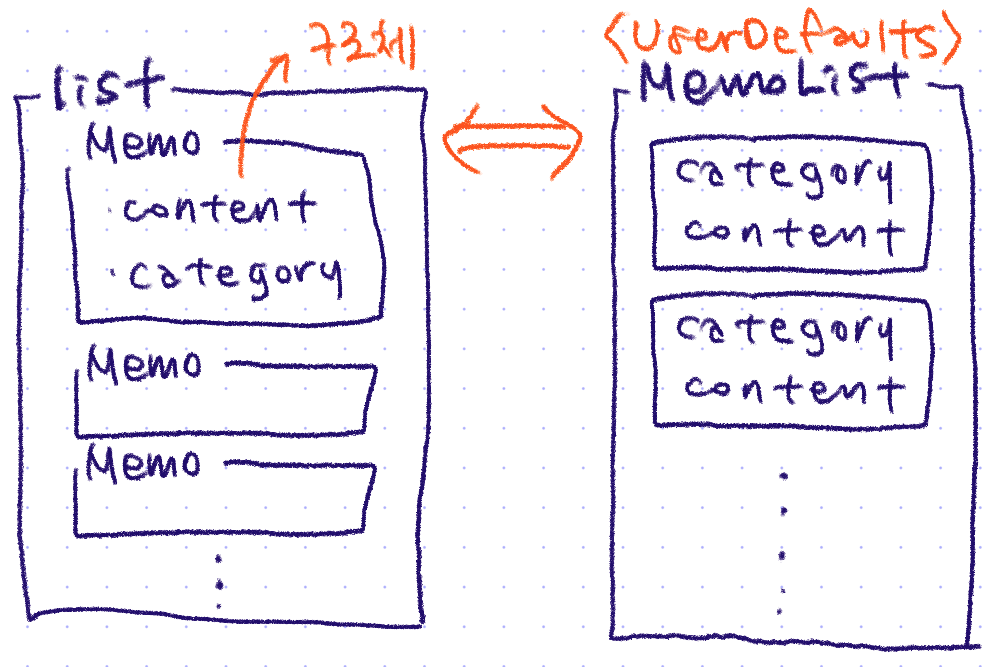
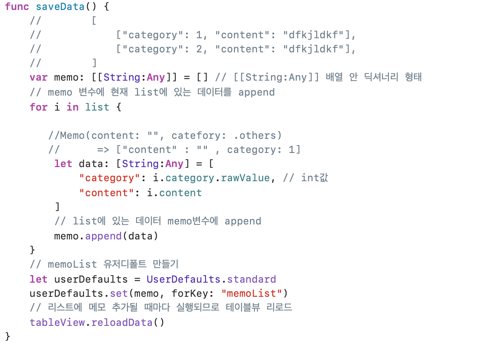
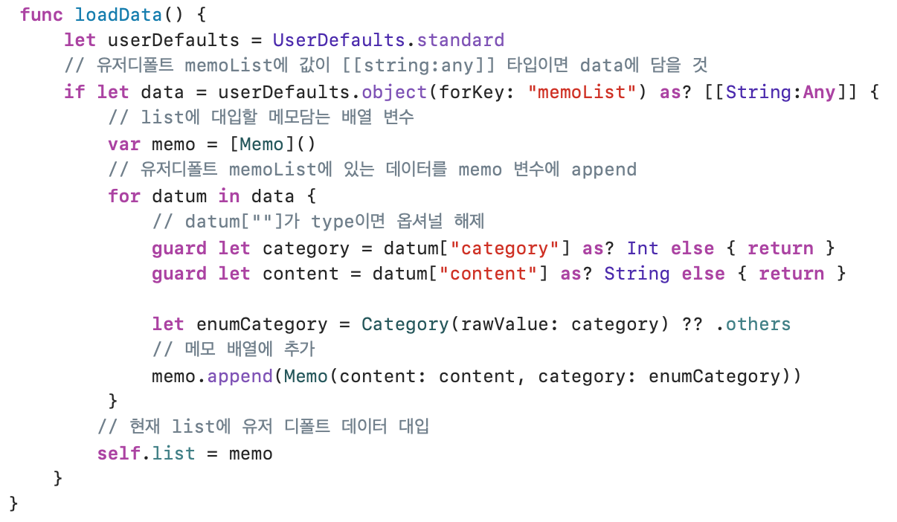

# 🟢 Day13 TIL - 211015 🟢

▶︎ [CodeReview: UserDefaults를 이용한 메모 데이터 저장하고 사용하기](#️-codereview)

▶︎ [화면 전환](#️-화면-전환)

▶︎ [Action Design Pattern: @Objc](#️-action-design-pattern)


***

<br>

## ✔️ CodeReview

* list는 구조체를 담고 있는 배열이고 UserDefaults는 기본 자료형 밖에 담지 못하므로 저장하거나 tableView에 보여줄 때 자료형을 변경해주어야 한다



```swift
var list = [Memo]() {
        didSet {
            // savebuttonclicked에서 list.append될 때마다 데이터 저장
            saveData()
        }
    }
```

```swift
// Memo.swift
// segment control의 index값을 사용하기 위해 Int로 선언하고 연산프로퍼티에서 분기문으로 string값
enum Category: Int {
    case business = 0, personal, others
    
    var description: String {
        switch self {
        case .business:
            return "업무"
        case .personal:
            return "개인"
        case .others:
            return "기타"
        }
    }
}

struct Memo {
    var content: String
    var category: Category
}
```

* saveData()

  * 리스트에 메모 추가될때 마다 실행되어 유저디폴트에 메모 저장

  *  list -> UserDefaults

    > 1. 유저디폴트에 list 넘겨주기 위한 배열(memo) 선언
    >
    > 2. 리스트에 있는 값을 memo에 append + 추가
    >
    > 3. memo로 유저디폴트 만들고 테이블뷰 리로드



* loadData()

  * 뷰에 뿌려주기 위해 유저디폴트에 있는 메모 리스트 데이터 받아오는 함수

  * UserDefaults -> list

    > 1. 유저디폴트에서 옵셔널 바인딩해서 메모리스트 꺼내오기
    > 2. list에 넣을 memo 배열 변수 선언
    > 3. 유저디폴트에서 category, content 가져와서 Memo타입으로 다시 만들어준 후 memo배열




<br>

<br>

## ✔️ 화면 전환

|                                            | Interface Builder | Source Code       |
| ------------------------------------------ | ----------------- | ----------------- |
| **아래 -> 위**<br>transition style 다양    | Modal             | present - dismiss |
| **우 -> 좌**<br>Navigation Controller 필수 | show              | push - pop        |

<br><br>

## ✔️ Action Design Pattern

Update later

<br><br>
