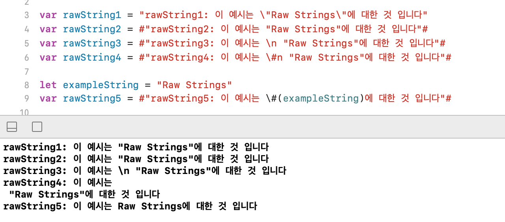

# 🟢 Day15 TIL - 211019 🟢

▶︎ [Raw Strings](#️-raw-strings)

▶︎ [CollectionView History](#️-collectionview-history)

***

 

## ✔️ Raw Strings

* **#**의 갯수를 동일하게 맞춰준다

 

 

## ✔️ CollectionView History

|        | data(무엇이)        | layout(어디에)       | Presentation(보여지는가)       |
| ------ | ------------------- | -------------------- | ------------------------------ |
| iOS 12 | DataSource          | FlowLayout           | Cell / ReusableView            |
| iOS 13 | Diffable DataSource | Compositional Layout | Cell / ReusableView            |
| iOS 14 | Section Snapshots   | List Configuration   | List Cell / View Configuration |

  
