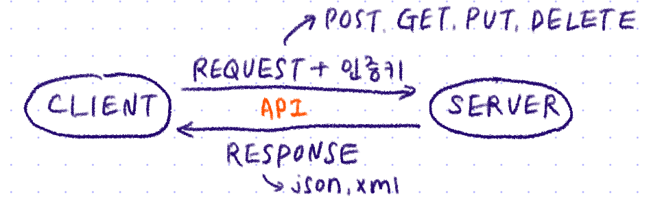

# 🟢 Day19 TIL - 211025 🟢

▶︎ [HTTP 특징](#️-http-특징)

▶︎ [Status Code](#️-status-code)

▶︎ [API Key](#️-api-key)

***

 

 

## ✔️ HTTP 특징

### 1. Request - Response

* #### 단방향 통신

  * 클라이언트의 요청이 있을 때 서버가 응답하는 방식
  * 서버가 클라이언트에게 먼저 정보를 줄 수 없다

* #### Connectionless

  * 클라이언트 요청에 대해 항상 새롭게 연결하고 해제

* #### Stateless

  * 서버는 클라이언트의 정보를 기억하고 있지 않기 때문에 클라이언트를 식별할 수 없다
  * **세션/ 쿠키(웹), 토큰(앱)**을 통해 클라이언트를 식별한다

 

### 2. HTTP Method

* 클라이언트가 서버에게 요청할 때, 요청하는 목적을 알리는 수단
* URLSession Framework => **Alamofire**
* json - json serialization => **SwiftyJSON**

​                - codable

* #### GET

  * 데이터를 **Query String**과 HTTP Header에 포함해 전달한다

  *  : URL 주소에 요청하고자 하는 데이터를 파라미터로 넘기는 형태

  * URL에 데이터를 포함해 요청하기 때문에 보안에 취약하다

  * URL 길이를 제한하고 있지는 않으나 브라우저에서 일반적으로 최대길이를 제한한다

    

* #### POST

  * 데이터를 **HTTP Body**에 포함해 전달한다
  * URL에 데이터를 포함하지 않기 때문에 최소한의 보안 구성은 되어있으나 보안 관점에서 유의미하지는 않다
  * 전송 데이터 길이에 제한이 없다

 

### 3. Key

 

 

## ✔️ Status Code

* 2xx : 성공
* 4xx : 클라이언트 오류
* 5xx : 서버 오류

 

 

## ✔️ API Key

1. swift 파일에 포함하지 않는다

2. gitignore

3. 환경변수 설정

   > [api key 숨기기](https://hongdonghyun.github.io/2020/06/iOS-환경변수-분리하기/)

  

