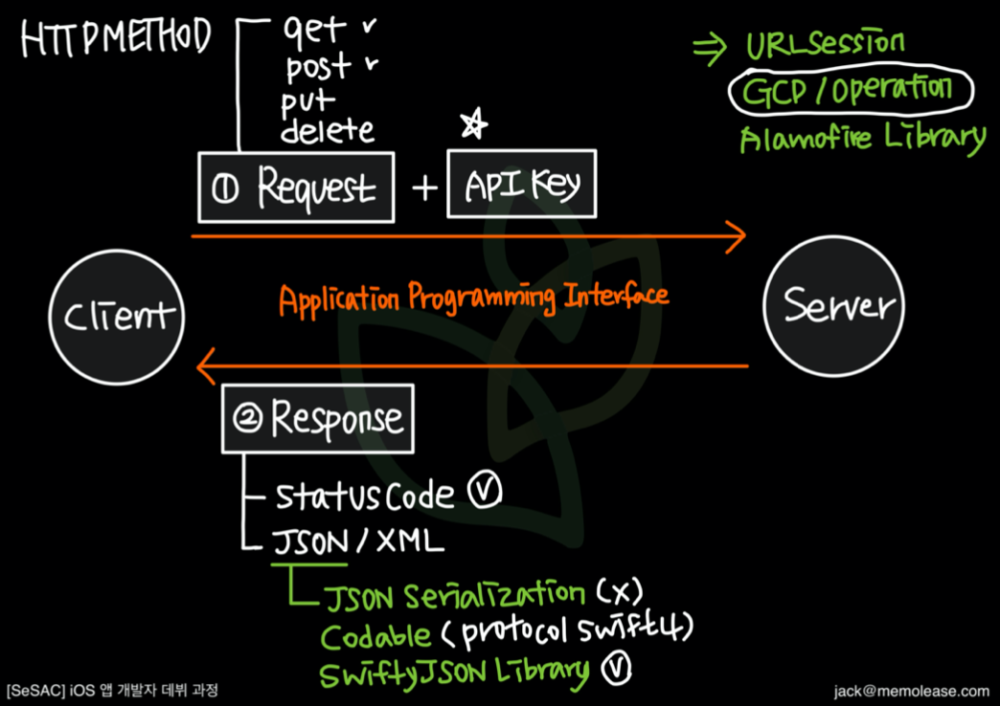
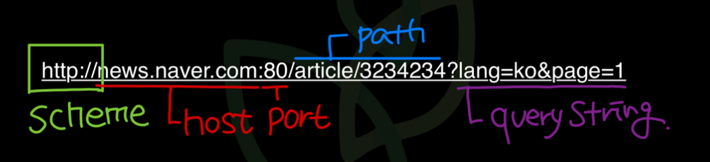
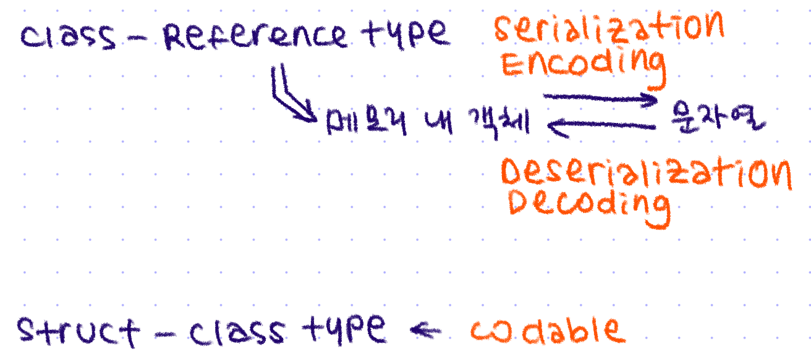

# 🟢 Day20 TIL - 211026 🟢

▶︎ [HTTP vs Socket](#️-http-vs-socket)

▶︎ [URL](#️-url)

▶︎ [REST API](#️-rest-api)

▶︎ [Serialization](#️-serialization)


***

<br>



<br>

## ✔️ HTTP vs Socket

| HTTP                | Socket                                  |
| ------------------- | --------------------------------------- |
| 단방향              | 양방향                                  |
| 클라이언트가 선요청 | 클라이언트 요청 없어도 데이터 전달 가능 |
| 비연결 지향 통신    | 연결 지향 통신                          |

<br>

<br>

## ✔️ URL



* Query String

  * URL에서는 기본적으로 ASCII 코드값만 사용가능

  * 한글, 특수문자(ASCII 코드에 해당하지 않는 문자)는 인코딩이 필요

  * URL Encoding(PercentEncoding)

    ```swift
    let query = "한글인코딩".addingPercentEncoding(withAllowedCharacters: .urlQueryAllowed)
    ```

    

<br>

<br>

## ✔️ REST API

* 문서, 이미지, 데이터 등의 컨텐츠와 기능을 네트워크를 통해 활용할 수 있도록 제공되는 인터페이스이자 **아키텍쳐 스타일** (규약이 있는 프로토콜은 아니기 때문에 지키면 좋다 정도)

* Resource를 중심으로 엔드포인트(URI)를 생성하고, HTTP Method를 통해 동작을 수행한다

  *  엔드포인트: 자원을 탐색하기 위한 URI, 모든 자원은 고유한 URI를 가지고 있다

* 데이터 포맷으로 json, xml 사용

* ### REST 6원칙

  * Uniform Interface: Resource에 대한 식별이 가능해야 하고, HTTP method를 통해 Resource에 대한 조작이 가능해야함
  * Stateless : 클라이언트의 상태가 서버에 저장되지 않고, 각 요청에 대한 응답을 전송 받는 것으로 요청 종료
  * Cacheable
  * Self-descriptiveness: REST API 메시지만 보고도, 어떤 의도로 구성되어 있는지 직관적으로 파악 가능해야함
  * Client-Server 구조
  * 계층형 구조

* ### 장점

  * API 엔드포인트나 메시지만 가지고 해당 API 의도를 직관적으로 파악할 수 있다
  * 특정 언어나 기술에 종속되지 않는다

* ### 단점

  * Overfetching:  필요한 정보값 보다 더 많은 정보값이 로딩
  * Underfetching: 필요한 정보보다 부족한 정보 로딩으로 추가 API 요청이 필요
  * Endpoint: 서비스 규모가 커질수록 엔드포인트가 늘어나 관리하기 어려워짐

<br><br>

## ✔️ Serialization



<br><br>


