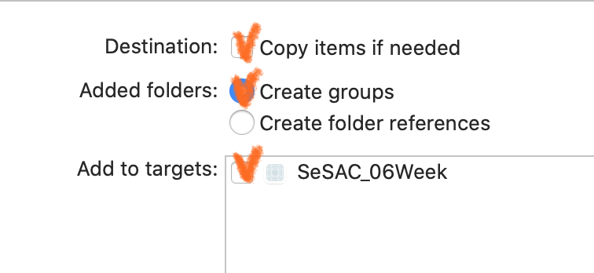
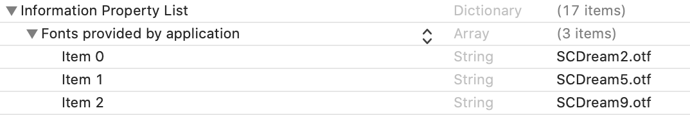
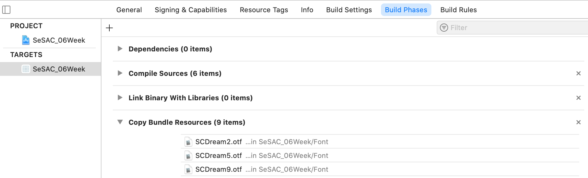
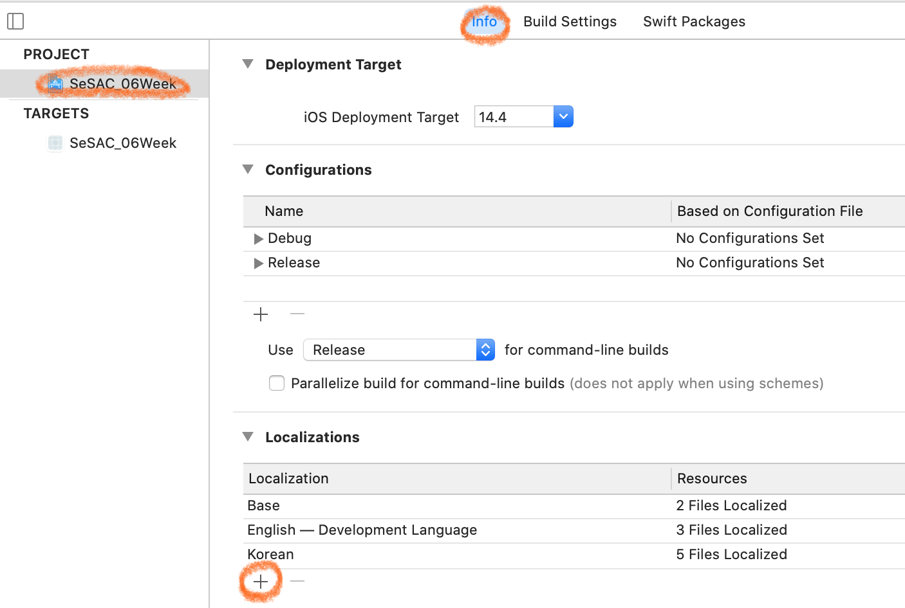
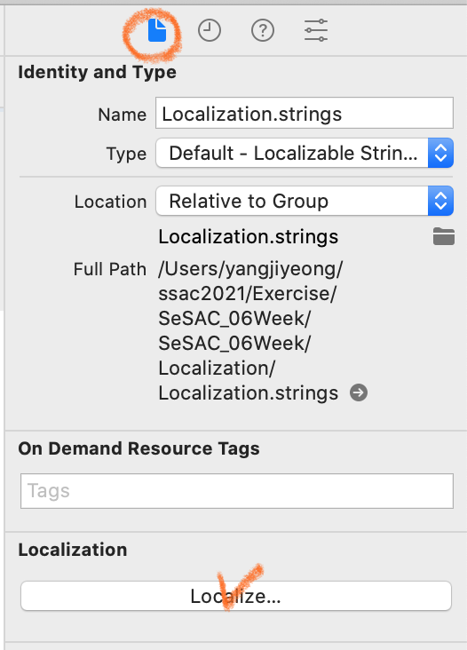

# 🟢 Day24 TIL - 211101 🟢

▶︎ [Custom Font](#️-custom-font)

▶︎ [Internationalization&Localization](#️-internationalization-&-localization)


***

<br>

## ✔️ Custom Font

1. 다운받은 폰트를 프로젝트에 넣는다. 이때 아래 세 가지에 체크



2. Info.plist에 등록한다



3. Build Phases에서 리소스로 등록되어있는지와 경로 확인

   

4. 등록해놓은 스니펫에서 폰트명 확인 후 사용

<br>

<br>

## ✔️ Internationalization&Localization

- ### Internationalization

  - i18n
  - 앱이 특정 국가나 지역에 종속되지 않도록 호환성을 위해 앱을 설계하는 과정, 즉 다국어를 표현할 수 있는 환경을 구성하는 것
  - 이를 통해 localization될 수 있음

* ### Localization

  * l10n

  * 해당 국가와 지역에 맞게 앱을 번역하고 리소스 작업을 하는 등 적합하도록 구현하는 과정

    <br>

* ### 다국어 지원하는 방법

  * xconfig
  * Storyboard Object ID (주로 변경되지 않는 것들)
  * **Localization.strings**
  * **InfoPlist.strings** (앱 이름이나 개인정보 보호 권한 문구)
  * Stringsdict (주로 단수나 복수 대응)

#### 1. Storyboard Object ID

​	① Localization에서 지원할 언어를 선택 후 스토리보드를 선택



​	② 해당 스토리보드 아래 파일에서 Object ID를 통해 다국어 설정

<br>

#### 2. Localization.strings

​	① `Strings File` 을 생성하는데 이름은 **Localizable.strings** (다른 이름으로도 변경 가능, tableName 설정하지 않으려면 이 이름으로)

​	② 인스펙터에서 다른 언어들을 추가해준 후 각 언어 파일에 필요한 string들을 적어준다



​	③ 사용할 뷰컨트롤러에서 `NSLocalizedString` 으로 현지화된 strings파일의 key값을 읽어 지원

```swift
welcomeLabel.text = NSLocalizedString("welcome_text", comment: "")

backupRestoreLabel.text = NSLocalizedString("data_backup", tableName: "Setting", bundle: .main, value: "", comment: "")
```

<br>

<details>
    <summary>"string"을 용납할 수 없는 경우 추가작업</summary>

* `String+Extensions` 파일을 만들어준 뒤 함수를 만든다

  ```swift
  func localized(tableName: String = "Localizable") -> String {
          return NSLocalizedString(self, tableName: tableName, bundle: .main, value: "", comment: "")
      }
  ```

* string을 대신할 열거형을 담을 swift 파일도 하나 만들어준다

  * 위에서 만든 함수를 이용해 반환시켜줄 연산프로퍼티들도 작성해준다

    ```swift
    enum LocalizableStrings: String {
        case welcome_text
        case data_backup
        
        var localized: String {
            return self.rawValue.localized() // Localizable.strings
        }
        
        var localizedSetting: String {
            return self.rawValue.localized(tableName: "Setting") // Setting.strings
        }
    }
    ```

* 사용하기

  ```swift
  welcomeLabel.text = LocalizableStrings.welcome_text.localized      
  backupRestoreLabel.text = LocalizableStrings.data_backup.localizedSetting
  ```

  

</details>

 <br>

#### 3. InfoPlist.strings

​	① **InfoPlist.strings** 파일을 만든다

​	② info.plist에서 source code로 필요한 key를 가져와 **InfoPlist.strings** 파일에서 구현한다

<br>

<br>

