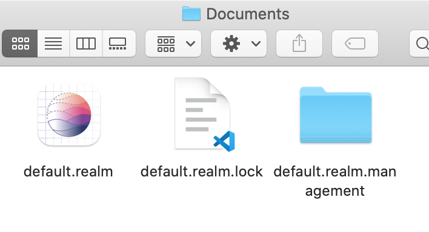

# 🟢 Day25 TIL - 211102 🟢

▶︎ [Realm](#️-realm)


***

<br>

## ✔️ Realm

* sheme에 맞게 realm model(table)을 정의해준다

* 이때 PK는 별도(String, Int)로 설정하거나 UUID, ObjectID를 사용할 수 있다

```swift
// RealmModel.swift
class UserDiary: Object {
    @Persisted var diaryTitle: String // 제목(필수)
    @Persisted var content: String? // 내용(옵션)
    @Persisted var writeDate = Date() // 작성날짜(필수)
    @Persisted var regDate = Date() // 등록일(옵션)
    @Persisted var favorite: Bool // 즐겨찾기 기능(필수)

    //PK(필수): Int, String, UUID, Object ID -> AutoIncrement
    @Persisted(primaryKey: true) var _id: ObjectId
    
    convenience init(diaryTitle: String, content: String?, writeDate: Date, regDate: Date) {
        self.init()
        self.diaryTitle = diaryTitle
        self.content = content
        self.writeDate = writeDate
        self.regDate = regDate
        self.favorite = false
    }
}
```

<br>

### CREATE

* Realm table 경로(default.realm 위치)에 접근한 후, 저장한다

```swift
// 데이터 저장을 해야하는 VC
let localRealm = try! Realm() // 경로 접근

// 데이터 저장할 func 안에서
let task = UserDiary(diaryTitle: addTitle.text!, content: addTextView.text!, writeDate: Date(), regDate: Date())
        try! localRealm.write {
            localRealm.add(task)
        }
```

* Realm studio로 데이터 확인하기

```swift
print("Realm is located at: \(localRealm.configuration.fileURL!)")
```



<br>

### READ

* Realm의 데이터를 담을 배열을 선언 후, 데이터를 가져오는데 이때 정렬이 되어있지 않으므로 filter나 sorted를 통해 정렬해주는 것이 좋다

```swift
let localRealm = try! Realm()
var tasks: Results<UserDiary>!

tasks = localRealm.objects(UserDiary.self).sorted(byKeyPath: "regDate", ascending: false)
```

<br>

<br>

