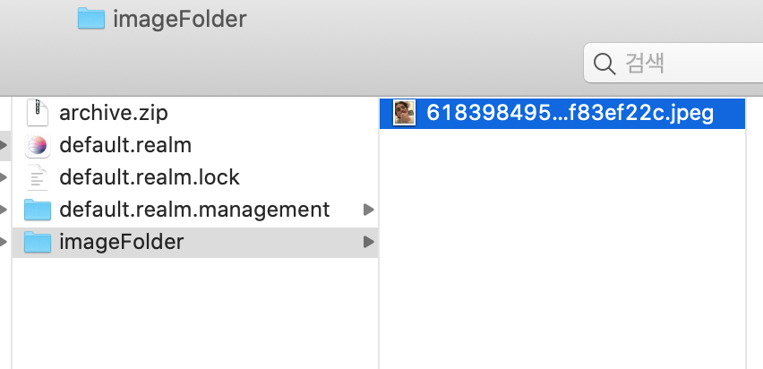
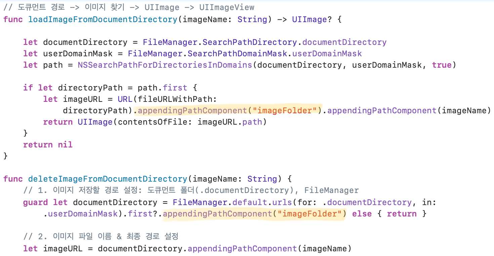

# 🟢 Day27 TIL - 211104 🟢

▶︎ [FileManager: 폴더 만들어서 사진 저장하기](#️-filemanager)


***

<br>

## ✔️ FileManager

* 기존에 수업에서 `document directory`에 사진을 저장하는 법을 배웠는데, 오늘 백업 복구 수업을 들으면서 지금처럼 냅다 `document directory`에 사진을 저장하면 백업 관리가 힘들것 같다는 생각이 들었다

* 그래서 사진 저장 시 사진 저장 폴더를 만들어주고 사진은 모두 이 폴더에서 관리해주려고 한다

  <br>

* 기존에는 1**. 이미지를 저장할 경로를 설정**하고 2. 이미지 파일 이름과 최종 경로를 설정해주었다

  ```swift
  // 1.
  guard let documentDirectory = FileManager.default.urls(for: .documentDirectory, in: .userDomainMask).first else { return }
  // 2.
  let imageURL = documentDirectory.appendingPathComponent(imageName)
  ```

* 폴더는 위의 두 과정 사이에서 만들어주면 된다

  ```swift
  // 만들 폴더이름을 넣어주기
  let folderPath = documentDirectory.appendingPathComponent("imageFolder")
  // 새 폴더를 만들기        
  if !FileManager.default.fileExists(atPath: folderPath.path) {
      do {
          try FileManager.default.createDirectory(atPath: folderPath.path, withIntermediateDirectories: false, attributes: nil)
       } catch {
          print("cannot create folder")
      }
  }
  ```

* 이미지 파일을 저장할 최종 경로를 바꿔주면 끝

  ```swift
  let imageURL = folderPath.appendingPathComponent(imageName)
  ```

  <br>

* 그럼 이렇게 파일이 만들어지고 그 안에 사진이 잘 저장된다 

  

  <br>

* 마지막으로 이미지를 로드하고 삭제하는 곳에도 폴더로 경로를 설정해주는 코드를 추가해준다 ~~(이렇게 하는게 맞는건진 확실하지 않지만 어쨌든 돌아가긴 한다.. 파일매니저 너무 어렵다)~~




<br>

<br>

