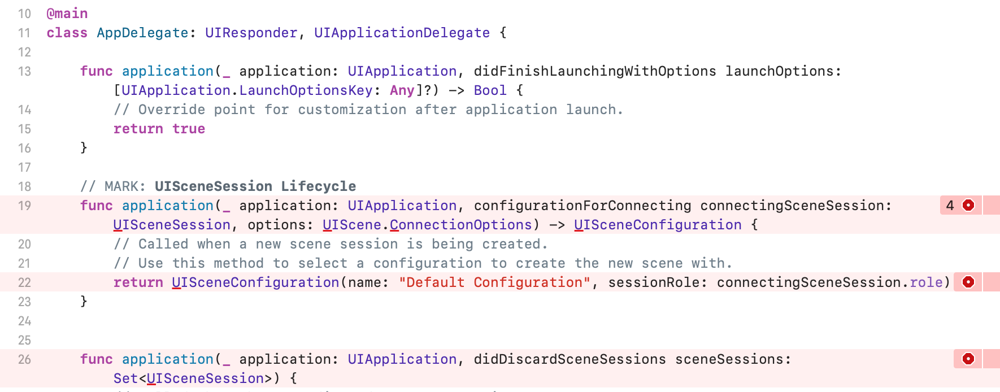
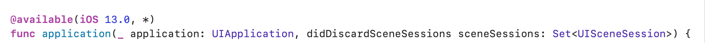
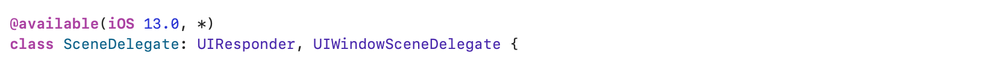
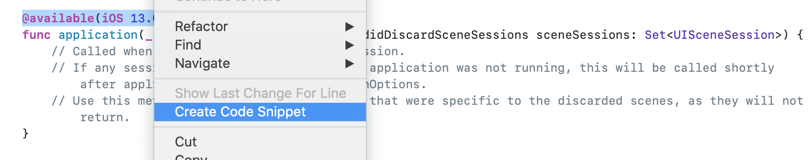

# 🟢 Day3 TIL - 210929 🟢

▶︎ [버전 대응](#️-버전-대응)

▶︎ [Mac Catalyst](#️-mac-catalyst)

▶︎ [ViewController LifeCycle](#️-viewcontroller-lifecycle)

▶︎ [iOS 계층구조](#️-ios-계층구조)

▶︎ [Xcode Tips: Debugging](#xcode-tips)


***


### ✔️ 버전 대응

 - **최소 버전을 iOS 12.0 이상으로 설정한 경우 오류**

   1. `AppDelegate` 파일을 확인해보면 버전 13 이후로 생긴 함수들에 대해 오류가 뜨고, `SceneDelegate`은 버전 13 때 생긴거라 모든 함수에서 에러가 뜬다.

   

   

   2. 12.0 버전의 시뮬레이터로 빌드해보면 빌드는 되지만, 까만화면이 뜬다고 한다.  

<br>

 - **해결방법**

   1. 필요한 부분 위(함수, 클래스 모두 가능)에 아래 코드를 적어준다.

   ```swift
   @available(iOS 13.0, *)
   ```

   

   

   > Snippets 사용법
   >
   > * 원하는 코드 드래그 후 우클릭
   >
   >   

   

   2. SceneDelegate에 있는 아래 코드를 `AppDelegate`에 적어준다

   ```swift
   @main
   class AppDelegate: UIResponder, UIApplicationDelegate {
   
       var window: UIWindow? // 추가
   
   ```

 <br>

<br>

### ✔️ Mac Catalyst ###

* `Mac Catalyst` 를 사용하면 iPad앱을 Mac앱으로 쉽게 전환가능하다. (iPhone 앱은 불가능)
* 기존에는 AppKit, UIKit, TVUIKit, WatchKit 프레임워크로 각각 개발하였는데, 이를 모두 합친 것이 `SwiftUI` 이다. M1칩 이후 더 많이 사용될 것이라고 한다.
* 어쨌든, M1칩 이후 ` Apple Sillicon Mac` 이 나와서 이 또한 과거이야기라고,,  

 <br>

<br>

### ✔️ ViewController LifeCycle ###

​	


1. __init__
   * VC 객체가 생성된다
2. __loadView__
   * 화면에 띄워줄 View를 만드는 함수로 View를 만들고 메모리에 올려준다
3. __viewDidLoad__
   * 화면이 처음 만들어질 때 한 번만 실행된다
   * 리소스 초기화나 초기 화면 구성 용도로 주로 사용한다
   * *Navigation Controller에서 view가 push될 때마다 viewDidLoad 호출된다* 
4. __viewWillAppear__
   * View가 나타나기 직전에 실행
   * 다른 뷰로 이동했다가 다시 돌아올 때마다 호출된다
5. __viewDidAppear__
   * View가 나타난 후 실행
   * View가 나타났다는 것을 VC에 알리는 역할로 화면에 적용될 애니메이션을 그려준다
6. __viewWillDisappear__
   * View가 사라지기 직전에 호출되는 함수로 뷰가 삭제되려고 하고 있는 것을 VC에 통지한다
7. __viewDidDisappear__
   * View가 사라지기 직후에 호출되는 함수
   * 화면이 사라지고 필요없어지거나 멈춰야하는 작업들을 여기서 한다
8. __viewDidUnload__
   * View가 메모리에서 해제된 뒤 호출

 <br>

<br>

### ✔️ iOS 계층구조 ###

* **Cocoa Touch** : 최상위 레벨의 프레임워크로 UIKit을 포함
* **Media** : 파일, 음악
* **Core Service** : GPS, 센서, 가속도 등 기기 자체 움직임이나 하드웨어 특성에 기반한 서비스 제공
* **Core OS** : 배터리, 전워 관리 등 하드웨어와 가까이 있는 최하위 계층

 <br>

<br>

<br>

### ❕Xcode Tips ###

* 디버깅 단축키 정리  ~~(Fn키는 설정에서 변경)~~
  * ctrl + cmd + y : 다음 브레이크포인트로 이동
  * F6 : 한줄 한줄 내려가면서 디버깅
  * F7 : 함수 안쪽으로 이동
  * F8 : 현재 함수 빠져 나옴
  * lldb p : 기존 변수 찍어볼때
  * lldb expr : 새로운 변수 넣어볼 때 


