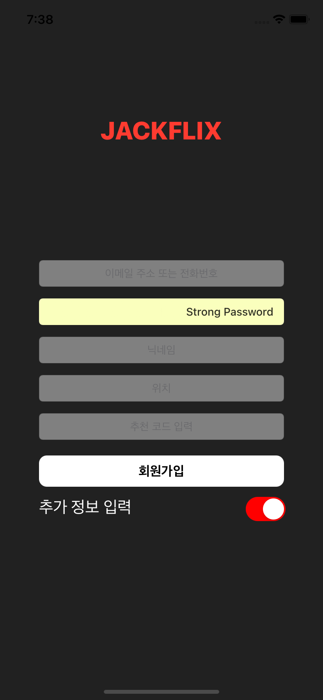

# 🟢 Day4 TIL - 210930 🟢

▶︎ [옵셔널](#️-옵셔널)

▶︎ [Dictionary](#️-dictionary)

▶︎ [Set](#️-set)

▶︎ [Tuple](#️-tuple)

▶︎ [Xcode Tips: playground, 자동완성창 읽기](#-xcode-tips)

▶︎ [Mission: 비밀번호 입력문제, 숫자만 입력되는 조건](#mission)


***


<br>

<br>

### ✔️ 옵셔널


<br>

<br>

### ✔️ Dictionary ###

* key와 value로 구성 (.key와 .value로 접근)
* key에 value가 종속되어 있어 key 삭제 시 value도 모두 사라진다
* key는 순서가 있지만 value는 순서가 없다

<br>

<br>

### ✔️ Set ###

* 집합과 동일한 특성을 지닌다
  * 집합 연산: `intersection`, `symmetricDifference`, `union`, `subtract`
* 값들은 중복될 수 없다
* 무조건 Set타입임을 명시해주어야 하는데 그렇지 않으면 배열로 타입추론한다

<br>

<br>

### ✔️ Tuple

* 다른 타입들을 담을 수 있는 자료형으로 어떤 형태든 마음대로 만들 수 있다
* 인덱스가 존재하므로 순서가 있다
* 한번 선언되면, 수정가 삭제가 불가능하다

```swift
var person = (1, true, 4.3, "jackson"m [0,2,3,1,2,3,4])
person.1 // true
person.0 + person.4[1] // 1 + 2 = 3
```

<br>

<br><br>

### 💡 Xcode Tips ###

* playground 재생 단축키 : `shift` + `Enter`
* Xcode 자동완성창 읽기
  * `P` : 프로퍼티
  * `M` : 메서드
  * `S` : 구조체
  * `Pr` : 프로토콜  

<br>

<br>

### 🔥Mission ###

#### 1. 비밀번호 입력 문제 ####

* 비밀번호 입력이 안된다. 한 글자만 입력되고 아래 그림과 같이 'Strong Password'와 함께 색이 변한 후 수정도 안된다! ~~콘솔창에 엄청난 에러메세지는 덤~~

* iCloud 키체인에 대한 문제라고 한다

* textField에 `textContentType` 값을 `oneTimeCode` 으로 설정해준다. 일회성 인증코드 같은거라고,,

  ```swift
  textfield.textContentType = .oneTimeCode
  ```



출처: https://fastutlego.tistory.com/86  

<br>

#### 2. 조건걸기: 숫자만 입력 ####

* 아래 코드로 동작은 하는데 에러메세지가 떠서 맞는 방법인지 모르겠다

```swift
codeTextField.delegate = self // UITextFieldDelegate 추가
```

```swift
func textField(_ textField: UITextField, shouldChangeCharactersIn range: NSRange, replacementString string: String) -> Bool {
            let invalidCharacters = CharacterSet(charactersIn: "0123456789").inverted
            return string.rangeOfCharacter(from: invalidCharacters) == nil
        }
```

코드 출처: https://medium.com/mobile-app-development-publication/making-ios-uitextfield-accept-number-only-4e9f569ae0c6

* 에러

> Can't find keyplane that supports type 4 for keyboard iPhone-PortraitTruffle-NumberPad; using 25901_PortraitTruffle_iPhone-Simple-Pad_Default

해결 방법으로 나오는 `I/O > Keyboard > Connect Hardware Keyboard 선택 해제` 이 방법으로 해결이 안된다,,  

<br>

* 단톡방에서 **형변환을 이용해서 해결**하는 아주 간단한 방법을 알려주셨다🙃

```swift
let userCode = Int(codeTextField.text ?? "")

if userCode != nil {
            print("CODE: \(userCode ?? 0)")
        } else {
            print("숫자만 입력 가능")
        }
```

