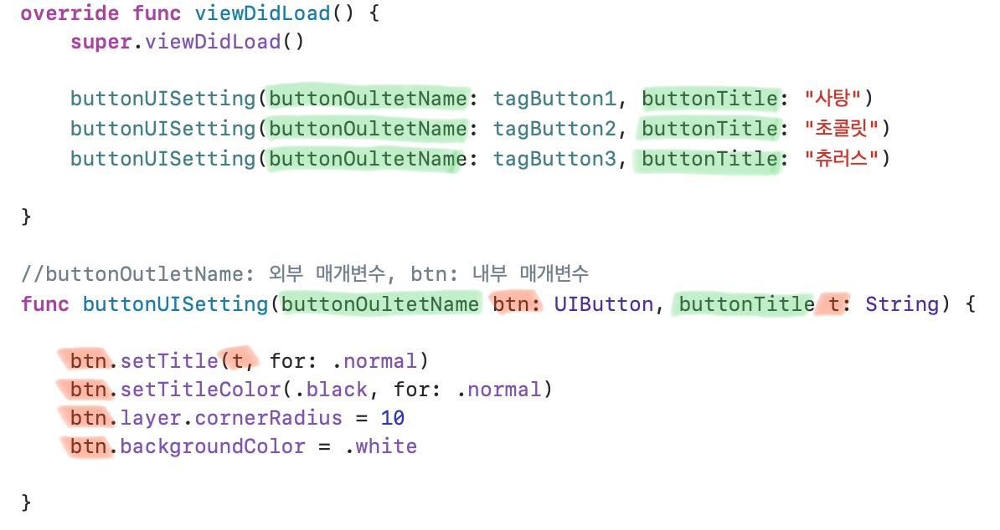

# 🟢 Day5 TIL - 211001 🟢

▶︎ [다크 모드 대응](#다크-모드-대응)

▶︎ [외부 매개변수와 내부 매개변수](#외부-매개변수와-내부-매개변수)

▶︎ [와일드 카드 식별자](#와일드-카드-식별자)

▶︎ [Xcode Tips: AutoLayout, Attributes Inspector](#Xcode-Tips)

***

### ✔️ 다크 모드 대응

* Info.plist 파일에 `Appearance` 추가
  * Light 
  * Dark

 

 

### ✔️ 외부 매개변수와 내부 매개변수

* **외부 매개변수** : 

 

 

### ✔️ 와일드 카드 식별자

 

  

### 💡 Xcode Tips

