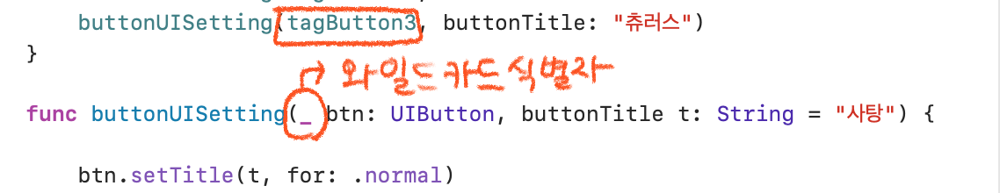

# 🟢 Day5 TIL - 211001 🟢

▶︎ [다크모드 대응](#️-다크모드-대응)

▶︎ [외부 매개변수와 내부 매개변수](#️-외부-매개변수와-내부-매개변수)

▶︎ [와일드 카드 식별자](#️-와일드-카드-식별자)

▶︎ [Xcode Tips: AutoLayout 단축키, Attributes Inspector 구조](#-xcode-tips)

***

 

## ✔️ 다크모드 대응 ##

* Info.plist 파일에 `Appearance` 추가
  * Light 
  * Dark

 

 

## ✔️ 외부 매개변수와 내부 매개변수 ##

* 외부 매개변수: 전달인자 레이블(Argument label)
* 내부 매개변수:  매개변수 이름(Parameter Name)

 

 

## ✔️ 와일드 카드 식별자 ##

* 외부 매개변수 이름 생략 가능

  

⭐️ 매개변수에 기본값을 포함하는 경우 `Overloading` 가능

 

  

## 💡 Xcode Tips ##

* AutoLayout 단축키

  * 커서를 선 위에 올리고 `option`키 누르면 레이아웃값 확인 가능

* Attributes Inspector 구조

  

