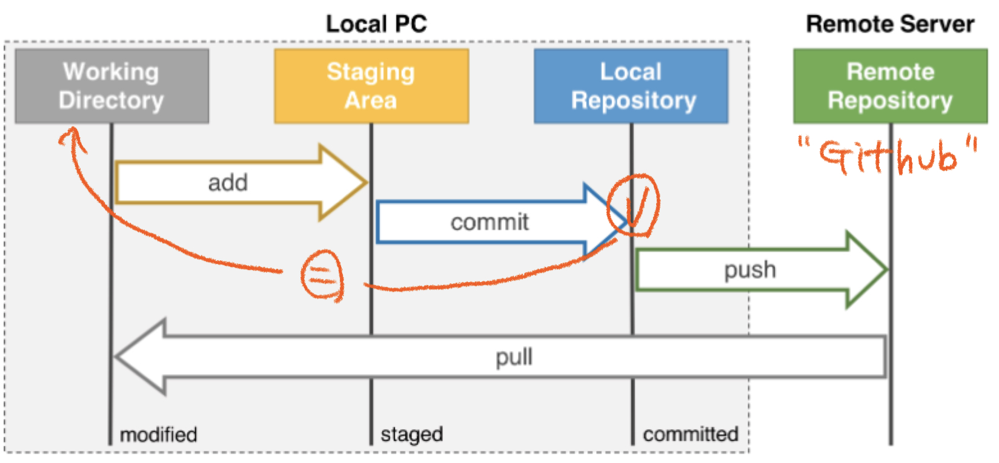
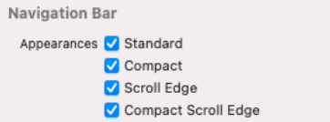
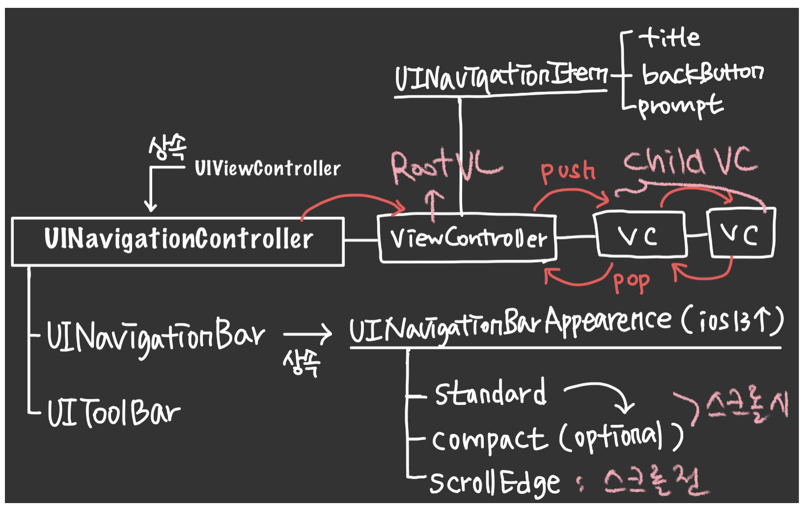
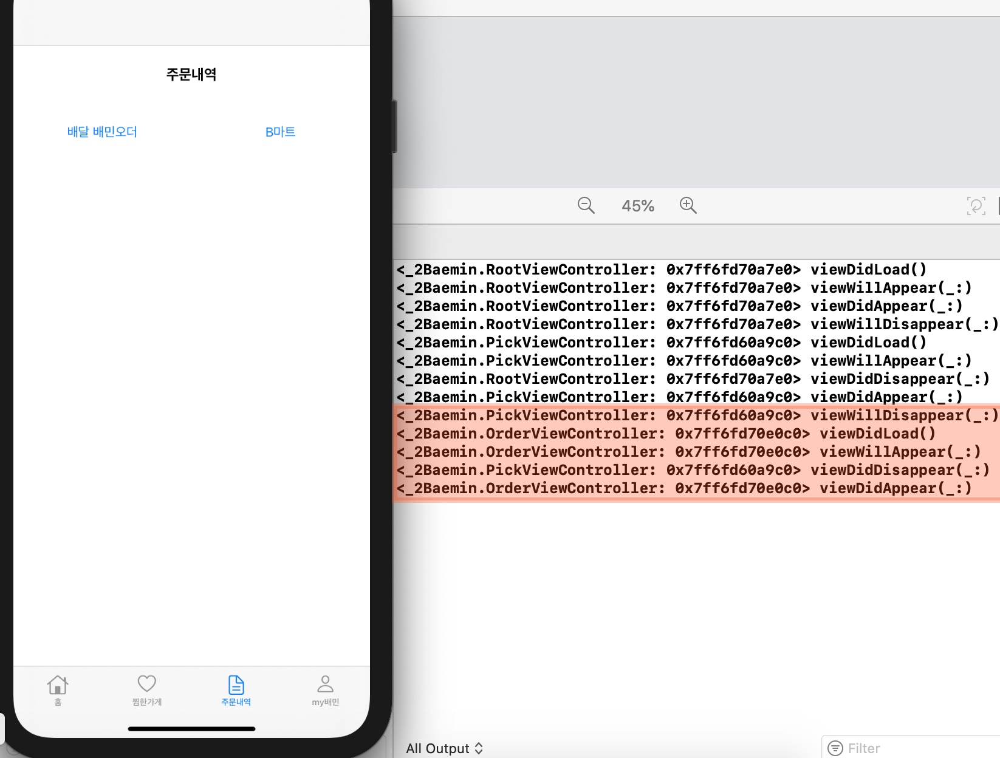
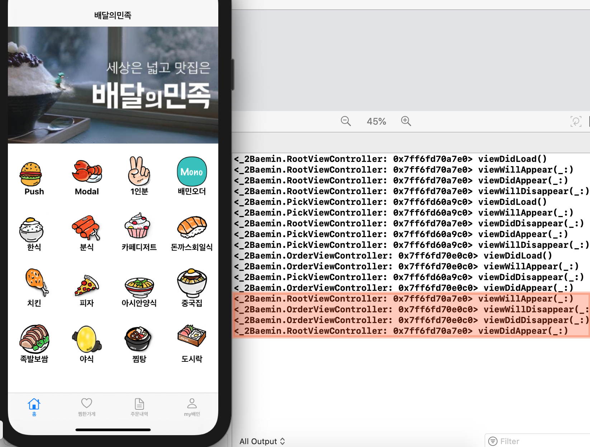
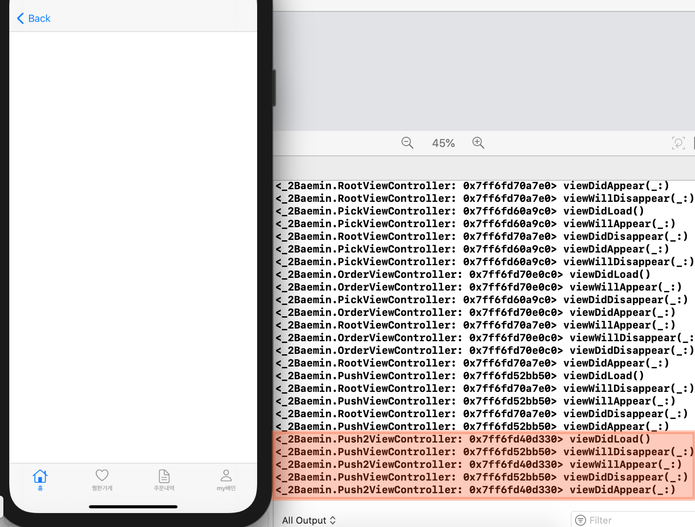
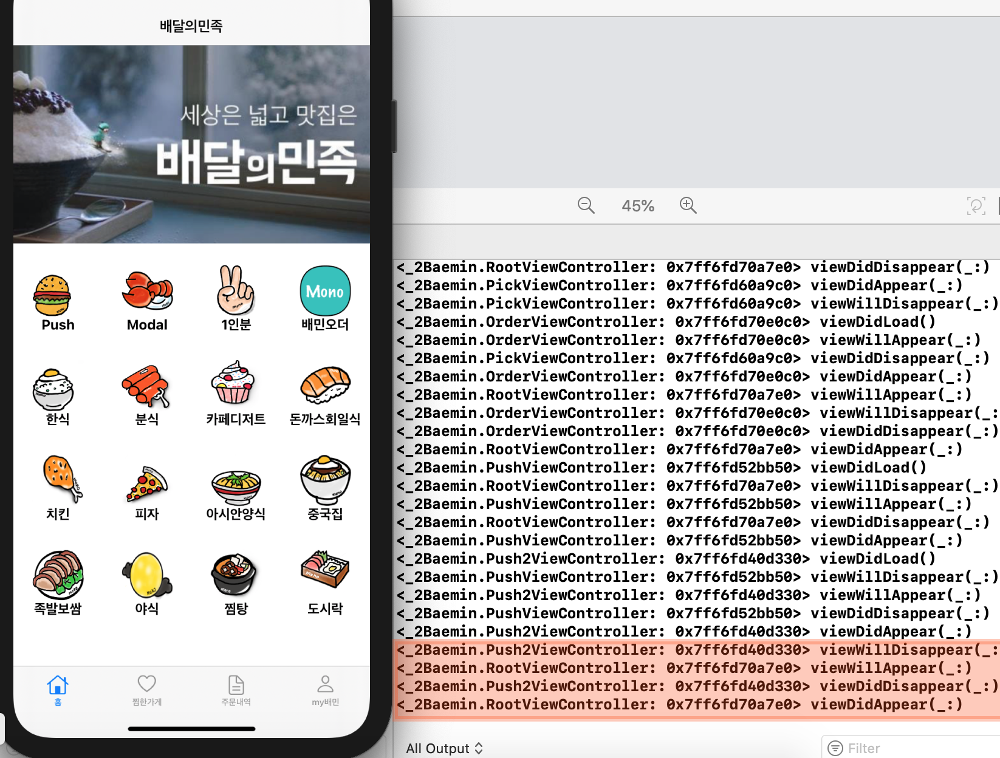
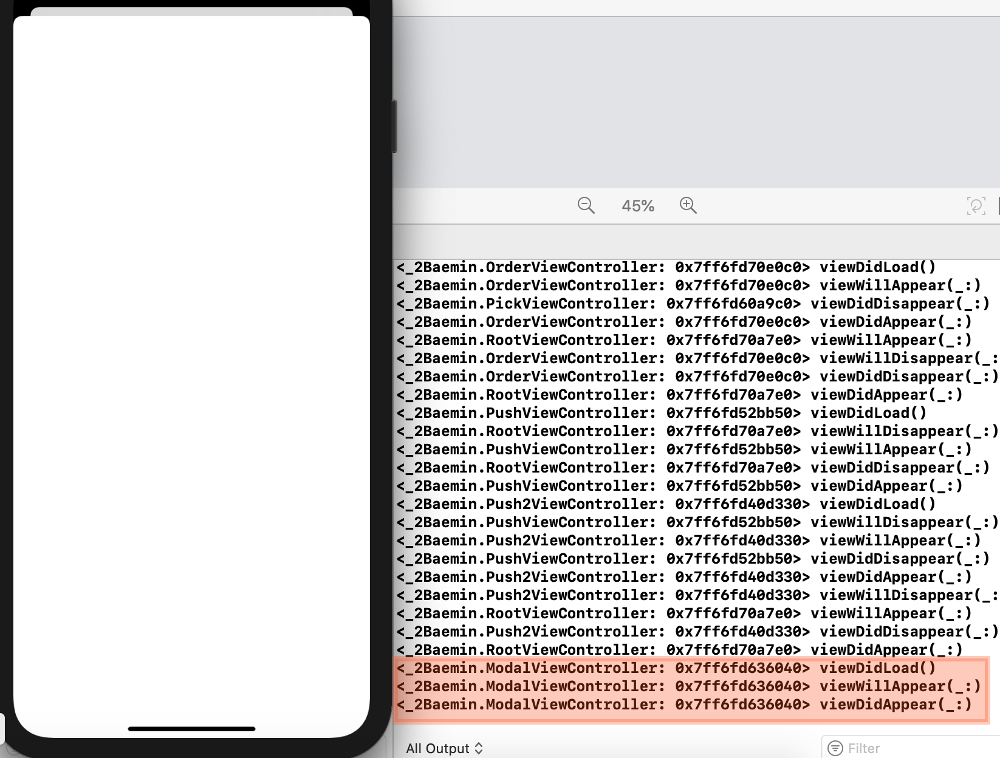
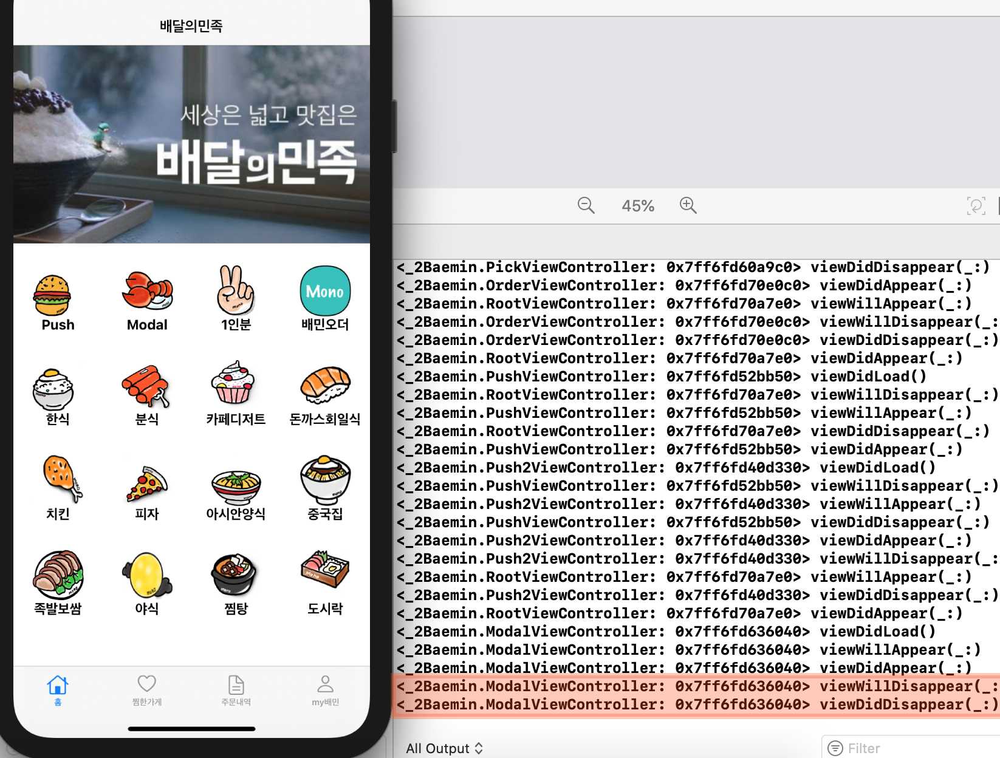

# 🟢 Day6 TIL - 211005 🟢

▶︎ [Git Status](#️-git-status)

▶︎ [Size Class](#️-size-class)

▶︎ [Navigation Controller](#️-navigation-controller)

▶︎ [ViewController LifeCycle 실습](#️-viewcontroller-lifecycle-실습)


***


### ✔️ Git Status



1. **Working Directory**
   * Remote Repository(원격 저장소)에서 clone 받을 경우 해당 파일이 Working Directory가 된다
   * 보통 .git Directory를 제외한 모든 것을 말한다
   * **`modified`: 파일을 수정했지만 아직 Commit되지 않은 상태, 즉 git에 반영되지 않은 수정된 파일**
2. **Staging Area** 
   * Working Directory에서 수정된 파일을 Local Repository에 Commit하기 전, 커밋할 파일을 선택하는 곳이Staging Area
   * **`staged`: 수정한 파일을 곧 Commit할 것이라고 표시해놓은 상태**

3. **Local Repository**
   + Commit되어 파일을 버전별로 관리할 수 있는 영역으로, Staging Area에 있는 파일을 Commit하여 Repository에 영구적인 **스냅샷**으로 저장한다
   + **`commited`: staged된 파일이 안전하게 저장된 상태, 이 파일들은 다시 Working Directory로 돌아간다**

<br>

<br>

### ✔️ Size Class ###

* 모든 화면에 대한 레이아웃을 대응해도 되지만 비효율적이기 때문에 Size Class를 통해 구현한다
* Size classes are traits that are automatically assigned to content areas based on their size
* As with other environmental variations, iOS dynamically makes layout adjustments based on the size classes of a content area
* 4가지 조합으로 구성
  * Regular width, regular height
  * Compact width, compact height
  * Regular width, compact height
  * Compact width, regular height

* **Device별 확인**
  
  > https://developer.apple.com/design/human-interface-guidelines/ios/visual-design/adaptivity-and-layout/
  
* `Xcode13` 은 Navigation Controller 에서 각 Size Class에 해당하는 UI를 별도로 구성할 수 있다



<br>

<br>

### ✔️ Navigation Controller ###

* 드릴다운 & 수직적 (Tabbar Controller는 수평적)



<br>

<br>

### ✔️ ViewController LifeCycle 실습

* [이전 개념정리](../TIL/day3-210929.md)

* #### 처음 화면 만들어질 때


* #### 처음 보는 Tab으로 이동할 때

  ```
  1. 이전 Tab: WillDisappear
  2. 현재 Tab: DidLoad //
  3. 현재 Tab: WillAppear
  4. 이전 Tab: DidDisappear
  5. 현재 Tab: DidAppear
  ```



* #### 한번 만들어졌던 Tab으로 이동할 때

  ```
  1. 현재 Tab: WillAppear 
  2. 이전 Tab: WillDisappear 
  3. 이전 Tab: DidDisappear
  4. 현재 Tab: DidAppear
  ```

  * **Tab은 처음에 만들어진 후에는 다시 `viewDidLoad` 하지 않는다**



* #### Push

  ```
  1. 현재 Push: DidLoad //
  2. 이전 화면: WillDisappear 
  3. 현재 Push: WillAppear
  4. 이전 화면: DidDisappear
  5. 현재 Push: DidAppear
  ```



* #### Push에서 돌아올때

  ```
  1. 이전 Push: WillDisappear 
  2. 현재 화면: WillAppear 
  3. 이전 Push: DidDisappear
  4. 현재 화면: DidAppear
  ```

  	* FirstView --`push`--> SecondView --`push`--> **ThirdView --`back`--> SecondView --`back`--> FirstView**
  	* **`back` 하는 상황에서 되돌아오는 현재 화면들(Second, FirstView)은 `viewDidLoad` 하지 않는다**




* #### Modal

  ```
  1. Modal 화면: DidLoad
  2. Modal 화면: WillAppear
  3. Modal 화면: DidAppear
  ```

  		* Modal로 들어가기 이전에 화면은 `willDisappear`, `didDisappear` 하지 않는다



* #### Modal에서 돌아올 때

  ```
  1. Modal 화면: WillDisappear
  2. Modal 화면: DidDisappear
  ```

  		* 돌아온 현재 화면에 대해 `viewDidLoad`, `willApear`, `didAppear` 하지 않는다



<br>

<br>

<br>
