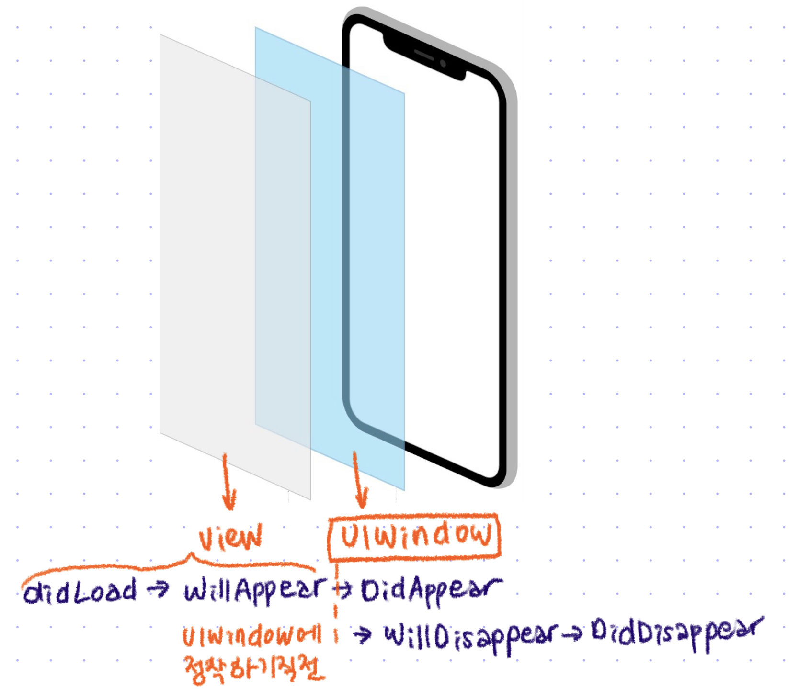
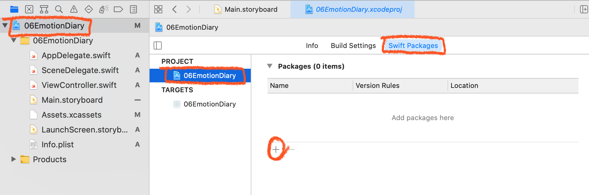
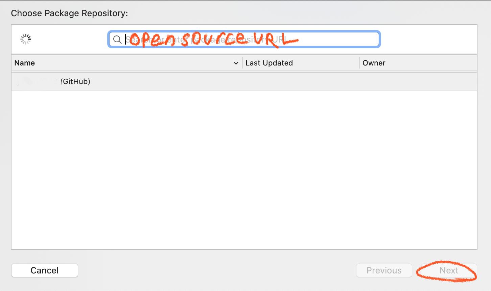
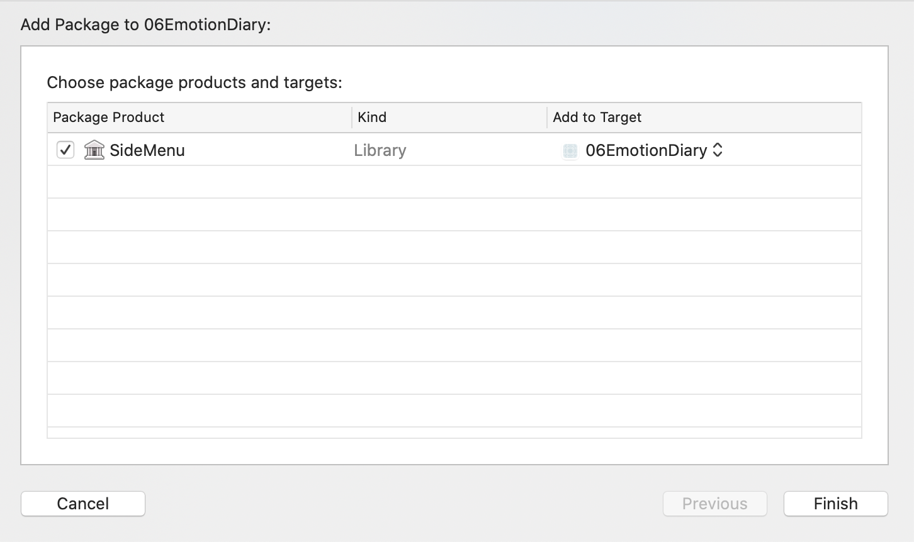
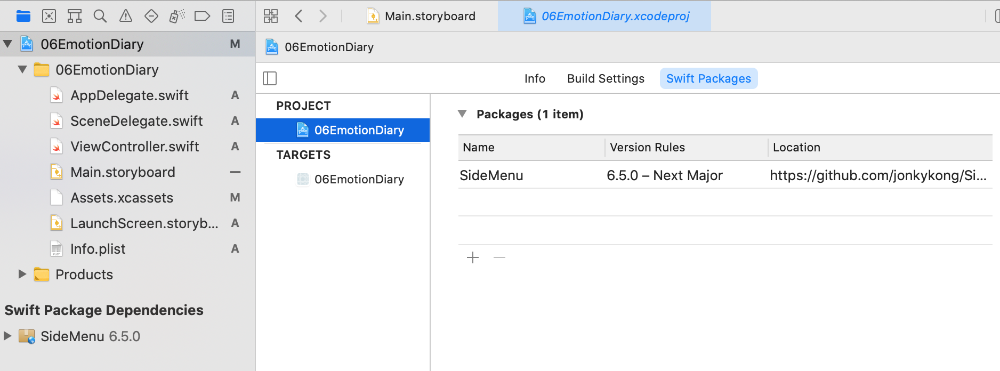
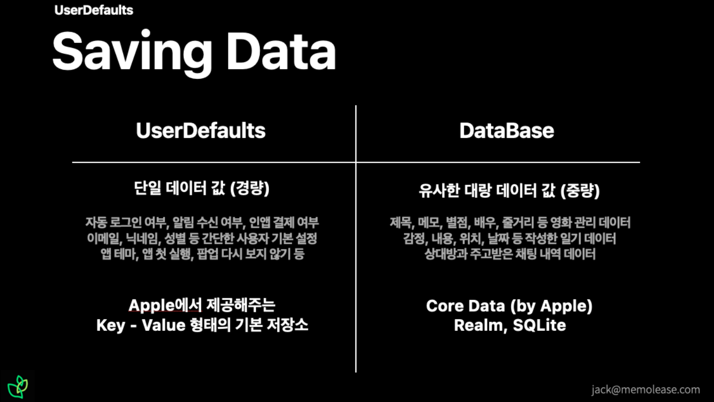

# 🟢 Day7 TIL - 211006 🟢

▶︎ [UIWindow와 ViewController LifeCycle](#️-uiwindow와-viewcontroller-lifecycle)

▶︎ [SwiftPM으로 라이브러리 사용하기](#️-swiftpm으로-라이브러리-사용하기)

▶︎ [User Defaults](#️-user-defaults)

▶︎ [Navigation Controller](#️-navigation-controller)


***

### ✔️ UIWindow와 ViewController LifeCycle



* UIWindow : UIView의 하위클래스로 뷰 계층의 최상위에 위치하며 여러 view들의 컨테이너 역할을 한다


### ✔️ SwiftPM으로 라이브러리 사용하기









* 오픈 소스의 README에서 설명하는 사용법에 따라 사용한다

<br>

<br>

### ✔️ User Defaults ###



* .plist 형태로 저장되어 앱을 종료하더라도 데이터가 유지된다

* 싱글톤 인스턴스다

* 저장할 수 있는 값은 Int, Double, Float, String, Bool, Data와 이로 이루어진 Array, Dictionary

* 커스텀 클래스의 경우 NSKeyedArchiever 등을 사용해 Data로 전환한 뒤에 저장해야한다

* ```swift
  //Setting Default Values
  //UserDefaults.standard.set(value, forKey: "CustomKey")
  let userText = mottoTextField.text ?? "열심히 살자"
  UserDefaults.standard.set(userText, forKey: "userMotto")
  
  //Getting Default Values
  //UserDefaults.standard.value(forKey: "CustomKey")
  let userMotto = UserDefaults.standard.string(forKey: "userMotto")
  ```

<br>

<br>

<br>
