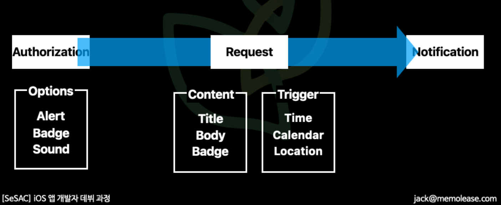

# 🟢 Day9 TIL - 211009 🟢

▶︎ [함수와 반환값](#️-함수와-반환값)

▶︎ [Enumeration](#️-enumeration)

▶︎ [Notification](#️-notification)


***

<br>

## ✔️ 함수와 반환값

* ### 반환 타입이 있는 함수

  * `func 함수명(매개변수 타입) -> 반환타입`
  * 배열이나 튜플을 활용해 반환타입을 지정할 수도 있다

  ```swift
  // 매개변수는 없지만 반환값은 있는 함수
  func sayHello() -> String {
      print("hi")
      return "hello"
  }
  
  // 배열 반환 타입
  func bmiResult() -> [String] {
      let name = "고래밥"
      let result = "정상"
      return [name, result]
  }
  
  // 튜플 반환 타입
  func getMoviewReport() -> (Int, Int) {
      return (1000, 30000)
  }
  ```

  <br>

* ### Implicit returns

  * **한 줄**에 대한 코드만 존재할 경우 **return 생략**이 가능하다

  ```swift
  func sayHello() -> String {
      "hello"
  }
  
  func getMoviewReport() -> (Int, Int) {
      (1000, 30000)
  }
  ```

  <br>

* ### 반환 타입을 무시할 수 있는 함수

  * `@discardableResult` 을 선언하면 반환값을 무시하고 함수를 사용할 수 있다

  ```swift
  @discardableResult
  func setViewBackground() -> UIColor {
      let random: [UIColor] = [.red, .black, .gray, .green]
      return random.randomElement() ?? UIColor.yellow
  }
  
  view.backgroundColor = setViewBackground()
  setViewBackground()	// @discardableResult때문에 가능
  ```

  <br>

  <br>

## ✔️ Enumeration

* 관련된 항목들을 묶어서 표현할 수 있는 타입

<br>

### 1. 열거형 문법

* **선언**

  ```swift
   // 선언 방법 1
  enum GameJob : String {
      case rogue
      case warrior
      case mystic
      case shaman
      case fight
  }
  
  // 선언 방법 2
  enum GameJob {
      case rogue, warrior, mystic, shaman, fight
  }
  ```

* **변수 생성**

  ```swift
  let selectJob: GameJob = GameJob.mystic
  let selectJob: GameJob = .mystic
  let selectJob = GameJob.mystic
  ```

<br>

* ### rawValue

  * 각 항목 자체로도 하나의 값이지만 특정 타입으로 지정된 값을 가질 수 있는데, 이것이 항목의 `rawValue(원시 값)`
  * `String`, `Character`, `Integer`,`Float`등의 형을 사용하고, 각 raw값은 열거형 선언에서 유일한 값으로 중복되어서는 안된다
  * 일부 값만 원시 값 줄 수 있다
  * Int 타입이면 자동으로 1씩 늘어난 값을 갖는다

  ```swift
  enum GameJob : String {
      case rogue = "도적"
      case warrior = "전사"
      case mystic = "도사"
      case shaman = "주술사"
      case fight = "격투가"
  }
  let selectJob = GameJob.mystic
  print("당신은 \(selectJob.rawValue)입니다")	// 당신은 도사입니다
  
  
  enum HTTPCode: Int {
      case OK = 200
      case SEVER_ERROR = 500
      case NO_PAGE	// 501
  }
  var status: HTTPCode = .NO_PAGE
  print(status.rawValue) // 501
  ```

  <br>

* ### switch

  ```swift
  enum HTTPCode: Int {
      case OK = 200
      case SEVER_ERROR = 500
      case NO_PAGE
      
      func showStatus() -> String {
          switch self {
          case .NO_PAGE:
              return "잘못된 주소입니다"
          case .SEVER_ERROR:
              return "서버 점검중입니다"
          case .OK:
              return "정상"
          }
      }
  }
  var status: HTTPCode = .NO_PAGE
  status.showStatus() // 잘못된 주소입니다
  ```

<br>

<br>

## ✔️ Notification

| Local Notification                                           | Remote Notification (Push)                                   |
| ------------------------------------------------------------ | ------------------------------------------------------------ |
| - 앱 내부에서 사용자 기기에 알림을 전송<br>- 같은 시간, 같은 문구<br>- 시뮬레이터 테스트, 무료 계정 | - 서버에서 사용자 기기에 알림을 전송<br>- 다른 시간, 다양한 컨텐츠<br>- 실제 디바이스 기기 테스트, 유료 계정 |

<br>

* 로컬 알림 과정

  

<br>

<br>
